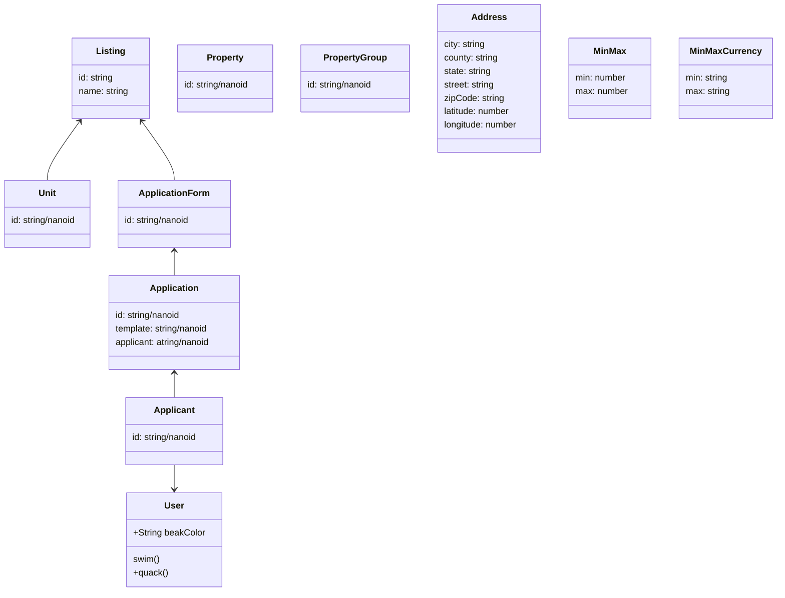

```mermaid
classDiagram
	Listing <-- Unit
  Listing <-- ApplicationForm
	ApplicationForm <-- Application
	Application <-- Applicant
  Applicant --> User
	class User {
		+String beakColor
		swim()
		+quack()
	}
  class Property {
    id: string/nanoid
  }
  class PropertyGroup {
    id: string/nanoid
  }
class Listing {
  id: string
  name: string
}
class Unit {
  id: string/nanoid
}
class ApplicationForm {
  id: string/nanoid
}
class Application {
  id: string/nanoid
  template: string/nanoid
  applicant: atring/nanoid
}
class Applicant {
  id: string/nanoid

}
class Address {
  city: string
  county: string
  state: string
  street: string
  zipCode: string
  latitude: number
  longitude: number
}
class MinMax {
  min: number
  max: number
}
class MinMaxCurrency {
  min: string
  max: string
}
```
