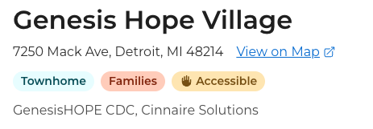

# Home Type - enableHomeType

## Name

`enableHomeType`

## Description

When true, the home type feature is turned on. It allows the ability to show the type of building each property is on the public site as well as providing the ability to filter by these types.

## Additional Information

Available options of home types are "Apartment", "Duplex", "Single-Family House", and "Townhome". These are currently hardcoded and the same for all jurisdictions.

## Images

Partner experience

Public experience - Listing Details page (Townhome tag)

Public experience - Listing Browse page (Townhome tag)

