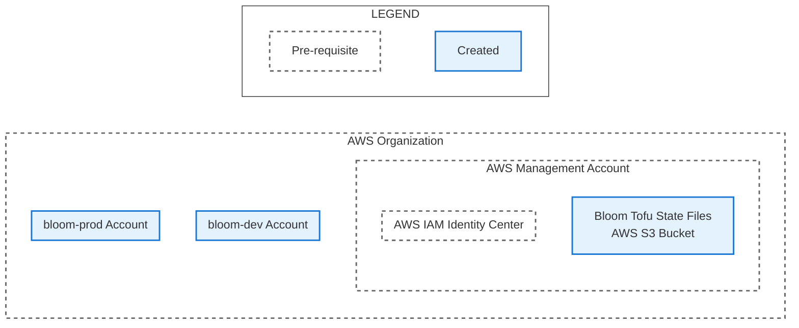

# AWS Deployment Guide

This directory contains instructions for deploying Bloom dev and prod environments to an AWS
organization. The organization management AWS account is required to have an IAM Identity Center
instance in it.

These steps will create the following resources:

+   %% Green for Terraform created
+   classDef terraform fill:#e8f5e9,stroke:#388e3c,stroke-width:2px
+   %% Apply terraform style (green)
+   class POL_DEV_INLINE,POL_PROD_INLINE,L3 terraform

*Diagram created by prompting Claude Opus 4.1 and manually edited.*

## Before these steps

This guide requires permissions to:

1. Create AWS accounts in an organization.
2. Create a S3 bucket in the organization's management account.
3. Create Groups in the organization's IAM Identity Center instance and add users to the groups.
4. Create Permission sets in the organization's IAM Identity Center instance and assign the
   Permission sets to the organization's management account and the created AWS accounts.

Additionally, this guide requires certain resource details and ARNs to be noted for future
steps. The guide will call-out specific values to copy with bolded instructions like **Note the
...**.

## Steps

### 1. Create AWS Accounts for each Bloom environment

1. Create an AWS account in the organization for the dev deployment. Give it a descriptive name like
   `bloom-dev`. **Note the account name and account number**.
2. Create an AWS account in the organization for the prod deployment. Give it a descriptive name
   like `bloom-prod`. **Note the account name and account number**.

### 2. Create a S3 Bucket to store the Open Tofu state files

An AWS S3 bucket is required to store Open Tofu state files. State files record the results of each
apply command. In the organization management account, create a S3 bucket:

1. In the 'General configuration' section:
   1. Select the 'General purpose' Bucket type.
   2. Enter a descriptive bucket name. S3 bucket names must be globally unique so different names
      may have to be tried before finding a name that is unused. For example, the S3 bucket used by
      the Bloom Core deployments is named 'bloom-core-tofu-state-files'. **Note the bucket name and
      the AWS region it is created in**.
2. In the 'Object Ownership' section, select the 'ACLs disabled (recommended)' option.
3. In the 'Block Public Access settings for this bucket' section, select the 'Block all public
  access' option.
4. In the 'Bucket Versioning' section, select the 'Enable' option. (this is highly recommended:
  https://opentofu.org/docs/language/settings/backends/s3/).

## After these steps

Your notes should have:

1. Account names and numbers for the created dev and prod accounts.
2. Name and region for the create S3 bucket.

Next, follow the [IAM Identity Center Configuration](./1_iam_identity_center_configuration.md) steps.
