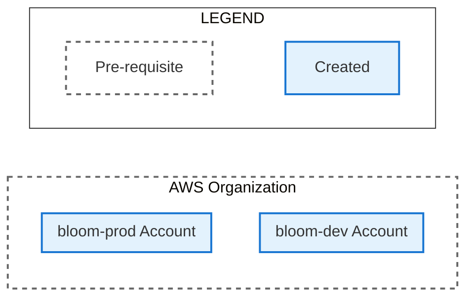

# Create AWS Accounts

This directory contains instructions for deploying Bloom dev and prod environments to an AWS
organization. The guide is broken down into a series of files that should be followed in order:

1. [Create AWS Accounts](./1_create_aws_accounts.md) (you are here)
2. [IAM Identity Center Configuration](./2_iam_identity_center_configuration.md)
3. [Create Tofu State S3 Bucket](./3_create_tofu_state_s3_bucket.md)
4. [Fork the Bloom Repo](./4_fork_bloom_repo.md)
5. [Apply Deployer Permission Set Tofu Modules](./5_apply_deployer_permission_set_tofu_modules.md)
6. [Apply Bloom Deployment Tofu Modules](./6_apply_bloom_deployment_tofu_modules.md)

The steps in this file will create the following resources:

## Required permissions

1. Create AWS accounts in an organization.

## Before these steps

1. Have an AWS organization that has an IAM Identity Center instance in the organization management
   account.

## Steps

1. Create an AWS account in the organization for the dev deployment. Give it a descriptive name like
   `bloom-dev`. **Note the account name and account number**.
2. Create an AWS account in the organization for the prod deployment. Give it a descriptive name
   like `bloom-prod`. **Note the account name and account number**.

## After these steps

Your notes should have:

1. Account names and numbers for the created dev and prod accounts.
