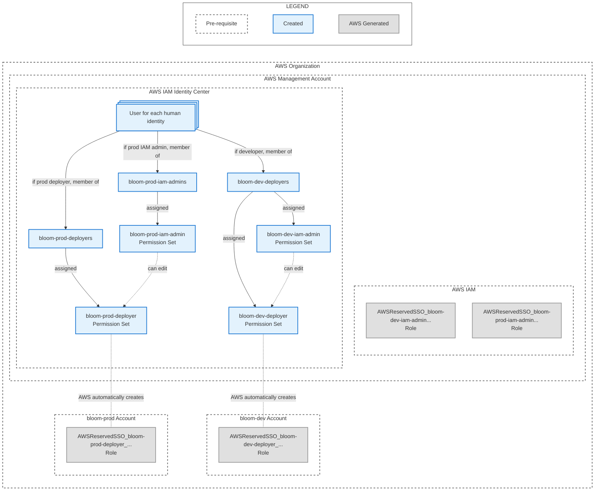

# IAM Identity Center Configuration

These steps will create the following resources:



*Diagram created by prompting Claude Opus 4.1 and manually edited.*

## Before these steps

1. Follow the initial steps in the [AWS Deployment Guide](./0_README.md).
2. Open the organization management account and go the to IAM Identity Center settings page. **Note
   the IAM Identity Center Instance ARN**.

## Steps

### 1. Create IAM Identity Center Users and Groups

1. Create an IAM Identity Center user for every person who will be interacting with the Bloom
   deployments, if they do not already have a user.
2. Create a `bloom-dev-deployers` IAM Identity Center group. Add the users who should have access to
   manage the dev Bloom deployment.
3. Create a `bloom-prod-iam-admins` IAM Identity Center group. Add the users who should have access
   to manage the `bloom-prod-deployers` permission set policy.
4. Create a `bloom-prod-deployers` IAM Identity Center group. Add the users who should have access
   to manage the prod Bloom deployment.

Optionally, create a `bloom-dev-iam-admins` if the group of people who should have access to manage
the `bloom-dev-deployer` permission set policy is different from the group of people should should
have the `bloom-dev-deployer` permissions.

### 2. Create IAM Identity Center Permission Sets

1. Create a `bloom-dev-deployer` IAM Identity Center permission set:
   1. In the 'Select permission set type' screen, select the 'Custom permission set' option.
   2. In the 'Specify policies and permission boundary' screen, do not set any polices and click the
      'Next' button.
   3. In the 'Specify permission set details' screen:
      1. Enter 'bloom-dev-deployer' in the 'Permission set name' field.
      2. Enter 'Permissions to manage the bloom-dev deployment' in the 'Description' field.
   4. Follow the rest of the screens and create the permission set. **Note the ARN of the created
      `bloom-dev-deployer` permission set**.

2. Create a `bloom-dev-iam-admin` IAM Identity Center permission set:
   1. In the 'Select permission set type' screen, select the 'Custom permission set' option.
   2. In the 'Specify policies and permission boundary' screen, expand the 'Inline policy'
      section. Paste in the following policy and change:

      - `CHANGEME_S3_BUCKET_NAME` to the S3 bucket name in your notes.
      - `CHANGEME_IAM_IDENTITY_CENTER_INSTANCE_ARN` to the IAM Identity Center instance ARN in your
        notes.
      - `CHANGEME_DEV_DEPLOYER_PERMISSIONSET_ARN` to the ARN in your notes from step 2.1.4.

      ```
      {
        "Version": "2012-10-17",
        "Statement": [
          {
            "Sid": "StateBucket",
            "Effect": "Allow",
            "Action": [
              "s3:ListBucket"
            ],
            "Resource": [
              "arn:aws:s3:::CHANGEME_S3_BUCKET_NAME"
            ]
          },
          {
            "Sid": "StateFiles",
            "Effect": "Allow",
            "Action": [
              "s3:GetObject",
              "s3:PutObject",
              "s3:DeleteObject"
            ],
            "Resource": [
              "arn:aws:s3:::CHANGEME_S3_BUCKET_NAME/bloom-dev-deployer-permissionset-policy/state",
              "arn:aws:s3:::CHANGEME_S3_BUCKET_NAME/bloom-dev-deployer-permissionset-policy/state.tflock"
            ]
          },
          {
            "Sid": "PermissionSet",
            "Effect": "Allow",
            "Action": [
              "sso:DeleteInlinePolicyFromPermissionSet",
              "sso:DescribePermissionSetProvisioningStatus",
              "sso:GetInlinePolicyForPermissionSet",
              "sso:ProvisionPermissionSet",
              "sso:PutInlinePolicyToPermissionSet"
            ],
            "Resource": [
              "CHANGEME_IAM_IDENTITY_CENTER_INSTANCE_ARN",
              "CHANGEME_DEV_DEPLOYER_PERMISSIONSET_ARN"
            ]
          }
        ]
      }
      ```
   3. In the 'Specify permission set details' screen:
      1. Enter 'bloom-dev-iam-admin' in the 'Permission set name' field.
      2. Enter 'Permissions to manage the bloom-dev-deployer permission set policy' in the
         'Description' field.
   4. Follow the rest of the screens and create the permission set.

3. Create a `bloom-prod-deployer` IAM Identity Center permission set.
   1. In the 'Select permission set type' screen, select the 'Custom permission set' option.
   2. In the 'Specify policies and permission boundary' screen, do not set any polices and click the
      'Next' button.
   3. In the 'Specify permission set details' screen:
      1. Enter 'bloom-prod-deployer' in the 'Permission set name' field.
      2. Enter 'Permissions to manage the bloom-prod deployment' in the 'Description' field.
   4. Follow the rest of the screens and create the permission set. **Note the ARN of the created
      `bloom-prod-deployer` permission set**.

4. Create a `bloom-prod-iam-admin` IAM Identity Center permission set.
   1. In the 'Select permission set type' screen, select the 'Custom permission set' option.
   2. In the 'Specify policies and permission boundary' screen, expand the 'Inline policy'
      section. Paste in the following policy then modify it with the following specifics:

      - `CHANGEME_S3_BUCKET_NAME` to the S3 bucket name in your notes.
      - `CHANGEME_IAM_IDENTITY_CENTER_INSTANCE_ARN` to the IAM Identity Center instance ARN in your
        notes.
      - `CHANGEME_PROD_DEPLOYER_PERMISSIONSET_ARN` to the ARN in your notes from step 2.3.4.

      ```
      {
        "Version": "2012-10-17",
        "Statement": [
          {
            "Sid": "StateBucket",
            "Effect": "Allow",
            "Action": [
              "s3:ListBucket"
            ],
            "Resource": [
              "arn:aws:s3:::CHANGEME_S3_BUCKET_NAME"
            ]
          },
          {
            "Sid": "StateFiles",
            "Effect": "Allow",
            "Action": [
              "s3:GetObject",
              "s3:PutObject",
              "s3:DeleteObject"
            ],
            "Resource": [
              "arn:aws:s3:::CHANGEME_S3_BUCKET_NAME/bloom-prod-deployer-permissionset-policy/state",
              "arn:aws:s3:::CHANGEME_S3_BUCKET_NAME/bloom-prod-deployer-permissionset-policy/state.tflock"
            ]
          },
          {
            "Sid": "PermissionSet",
            "Effect": "Allow",
            "Action": [
              "sso:DeleteInlinePolicyFromPermissionSet",
              "sso:DescribePermissionSetProvisioningStatus",
              "sso:GetInlinePolicyForPermissionSet",
              "sso:ProvisionPermissionSet",
              "sso:PutInlinePolicyToPermissionSet"
            ],
            "Resource": [
              "CHANGEME_IAM_IDENTITY_CENTER_INSTANCE_ARN",
              "CHANGEME_PROD_DEPLOYER_PERMISSIONSET_ARN"
            ]
          }
        ]
      }
      ```
   3. In the 'Specify permission set details' screen:
      1. Enter 'bloom-prod-iam-admin' in the 'Permission set name' field.
      2. Enter 'Permissions to manage the bloom-prod-deployer permission set policy' in the
         'Description' field.
   4. Follow the rest of the screens and create the permission set.

### 3. Assign the Permission Sets

On the IAM Identity Center 'AWS Organizations: AWS accounts' page:

1. Assign the `bloom-dev-iam-admin` permission set to the organization management account:
   1. Select the checkbox for the organization management account then click the 'Assign users or
      groups' button.
   2. Select the `bloom-dev-deployers` group checkbox then click the 'Next' button. **If a separate
      `bloom-dev-iam-admins` group was created in step 1, use that group instead of the
      `bloom-dev-deployers` group**.
   3. Select the `bloom-dev-iam-admin` permission set checkbox then click the 'Next' button.

2. Assign the `bloom-prod-iam-admin` permission set to the organization management account:
   1. Select the checkbox for the organization management account then click the 'Assign users or
      groups' button.
   2. Select the `bloom-prod-iam-admins` group checkbox then click the 'Next' button.
   3. Select the `bloom-prod-iam-admin` permission set checkbox then click the 'Next' button.

3. Assign the `bloom-dev-deployer` permission set to the dev account:
   1. Select the checkbox for the dev account in your notes then click the 'Assign users or groups'
      button.
   2. Select the `bloom-dev-deployers` group checkbox then click the 'Next' button.
   3. Select the `bloom-dev-deployer` permission set checkbox then click the 'Next' button.

4. Assign the `bloom-prod-deployer` permission set to the prod account:
   1. Select the checkbox for the prod account in your notes then click the 'Assign users or groups'
      button.
   2. Select the `bloom-prod-deployers` group checkbox then click the 'Next' button.
   3. Select the `bloom-prod-deployer` permission set checkbox then click the 'Next' button.

## After these steps

1. The organization management account should have assignments for the bloom-dev-iam-admin and
   bloom-prod-iam-admin permission sets.
2. The dev bloom account should have the bloom-dev-deployers permission set assigned.
3. The prod bloom account should have the bloom-prod-deployers permission set assigned.

Next, follow the [Apply Deployer Permission Set Open Tofu
Modules](./2_apply_deployer_permission_set_tofu_modules.md) steps.
