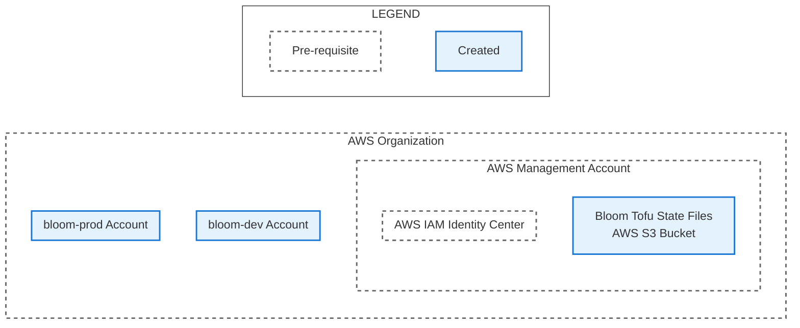

# Apply Deployer Permission Set Open Tofu Modules

TODO These steps will create the following resources:

*Diagram created by prompting Claude Opus 4.1 and manually edited.*

## Before these steps

## Steps

## After these steps
