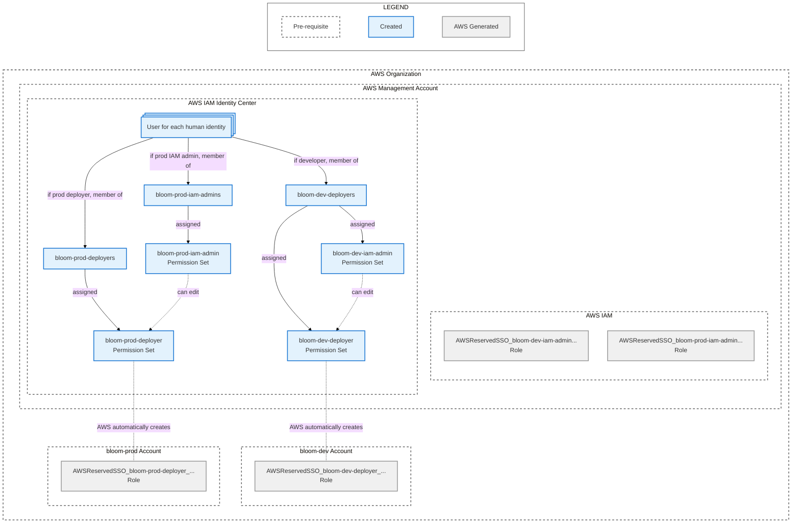

# IAM Identity Center Configuration

This directory contains instructions for deploying Bloom dev and prod environments to an AWS
organization. The guide is broken down into a series of files that should be followed in order:

1. [Create AWS Accounts](./1_create_aws_accounts.md)
2. [IAM Identity Center Configuration](./2_iam_identity_center_configuration.md) (you are here)
3. [Create Tofu State S3 Bucket](./3_create_tofu_state_s3_bucket.md)
4. [Fork the Bloom Repo](./4_fork_bloom_repo.md)
5. [Apply Deployer Permission Set Tofu Modules](./5_apply_deployer_permission_set_tofu_modules.md)
6. [Apply Bloom Deployment Tofu Modules](./6_apply_bloom_deployment_tofu_modules.md)

The steps in this file create the following resources:



## Required permissions

1. Create Users in the organization's IAM Identity Center instance.
2. Create Groups in the organization's IAM Identity Center instance and add users to the groups.
3. Create Permission sets in the organization's IAM Identity Center instance and assign the
   Permission sets to the organization management account and the dev and prod Bloom accounts.
4. List and read roles in the organization management account and the dev and prod Bloom accounts.

## Before these steps

1. Complete the steps in the [Create AWS Accounts](./1_create_aws_accounts.md). The AWS account
   numbers for the dev and prod Bloom accounts will be needed.
2. Open the organization management account and go to the 'IAM Identity Center > Settings'
   page. **Note the IAM Identity Center Instance ARN, Region, and the AWS access portal URL**.

## Steps

### 1. Create IAM Identity Center Users and Groups

1. Create an IAM Identity Center user for every person who will be interacting with the Bloom
   deployments, if they do not already have a user.
2. Create a `bloom-dev-deployers` IAM Identity Center group. Add the users who should have access to
   manage the dev Bloom deployment.
3. Create a `bloom-prod-iam-admins` IAM Identity Center group. Add the users who should have access
   to manage the `bloom-prod-deployers` permission set policy.
4. Create a `bloom-prod-deployers` IAM Identity Center group. Add the users who should have access
   to manage the prod Bloom deployment.

Optionally, create a `bloom-dev-iam-admins` if the group of people who should have access to manage
the `bloom-dev-deployer` permission set policy is different from the group of people should should
have the `bloom-dev-deployer` permissions.

### 2. Create IAM Identity Center Permission Sets

1. Create a `bloom-dev-deployer` IAM Identity Center permission set:
   1. In the 'Select permission set type' screen, select the 'Custom permission set' option.
   2. In the 'Specify policies and permission boundary' screen, do not set any polices and click the
      'Next' button.
   3. In the 'Specify permission set details' screen:
      1. Enter 'bloom-dev-deployer' in the 'Permission set name' field.
      2. Enter 'Permissions to manage the bloom-dev deployment' in the 'Description' field.
   4. Follow the rest of the screens and create the permission set. **Note the ARN of the created
      `bloom-dev-deployer` permission set**.

2. Create a `bloom-dev-iam-admin` IAM Identity Center permission set:
   1. In the 'Select permission set type' screen, select the 'Custom permission set' option.
   2. In the 'Specify policies and permission boundary' screen, expand the 'Inline policy'
      section. Paste in the following policy and change:

      - `CHANGEME_IAM_IDENTITY_CENTER_INSTANCE_ARN` to the IAM Identity Center instance ARN in your
        notes.
      - `CHANGEME_BLOOM_DEV_ACCOUNT_NUMBER` to the Bloom dev account number in your notes.
      - `CHANGEME_DEV_DEPLOYER_PERMISSIONSET_ARN` to the ARN in your notes from step 2.1.4.

      ```
      {
        "Version": "2012-10-17",
        "Statement": [
          {
            "Sid": "PermissionSet",
            "Effect": "Allow",
            "Action": [
              "sso:DeleteInlinePolicyFromPermissionSet",
              "sso:DescribePermissionSetProvisioningStatus",
              "sso:GetInlinePolicyForPermissionSet",
              "sso:ProvisionPermissionSet",
              "sso:PutInlinePolicyToPermissionSet"
            ],
            "Resource": [
              "CHANGEME_IAM_IDENTITY_CENTER_INSTANCE_ARN",
              "arn:aws:sso:::account/CHANGEME_BLOOM_DEV_ACCOUNT_NUMBER",
              "CHANGEME_DEV_DEPLOYER_PERMISSIONSET_ARN"
            ]
          }
        ]
      }
      ```
   3. In the 'Specify permission set details' screen:
      1. Enter 'bloom-dev-iam-admin' in the 'Permission set name' field.
      2. Enter 'Permissions to manage the bloom-dev-deployer permission set policy' in the
         'Description' field.
   4. Follow the rest of the screens and create the permission set.

3. Create a `bloom-prod-deployer` IAM Identity Center permission set.
   1. In the 'Select permission set type' screen, select the 'Custom permission set' option.
   2. In the 'Specify policies and permission boundary' screen, do not set any polices and click the
      'Next' button.
   3. In the 'Specify permission set details' screen:
      1. Enter 'bloom-prod-deployer' in the 'Permission set name' field.
      2. Enter 'Permissions to manage the bloom-prod deployment' in the 'Description' field.
   4. Follow the rest of the screens and create the permission set. **Note the ARN of the created
      `bloom-prod-deployer` permission set**.

4. Create a `bloom-prod-iam-admin` IAM Identity Center permission set.
   1. In the 'Select permission set type' screen, select the 'Custom permission set' option.
   2. In the 'Specify policies and permission boundary' screen, expand the 'Inline policy'
      section. Paste in the following policy then modify it with the following specifics:

      - `CHANGEME_IAM_IDENTITY_CENTER_INSTANCE_ARN` to the IAM Identity Center instance ARN in your
        notes.
      - `CHANGEME_BLOOM_PROD_ACCOUNT_NUMBER` to the Bloom prod account number in your notes.
      - `CHANGEME_PROD_DEPLOYER_PERMISSIONSET_ARN` to the ARN in your notes from step 2.3.4.

      ```
      {
        "Version": "2012-10-17",
        "Statement": [
          {
            "Sid": "PermissionSet",
            "Effect": "Allow",
            "Action": [
              "sso:DeleteInlinePolicyFromPermissionSet",
              "sso:DescribePermissionSetProvisioningStatus",
              "sso:GetInlinePolicyForPermissionSet",
              "sso:ProvisionPermissionSet",
              "sso:PutInlinePolicyToPermissionSet"
            ],
            "Resource": [
              "CHANGEME_IAM_IDENTITY_CENTER_INSTANCE_ARN",
              "arn:aws:sso:::account/CHANGEME_BLOOM_PROD_ACCOUNT_NUMBER",
              "CHANGEME_PROD_DEPLOYER_PERMISSIONSET_ARN"
            ]
          }
        ]
      }
      ```
   3. In the 'Specify permission set details' screen:
      1. Enter 'bloom-prod-iam-admin' in the 'Permission set name' field.
      2. Enter 'Permissions to manage the bloom-prod-deployer permission set policy' in the
         'Description' field.
   4. Follow the rest of the screens and create the permission set.

### 3. Assign the Permission Sets

On the IAM Identity Center 'AWS Organizations: AWS accounts' page:

1. Assign the `bloom-dev-iam-admin` permission set to the organization management account:
   1. Select the checkbox for the organization management account then click the 'Assign users or
      groups' button.
   2. Select the `bloom-dev-deployers` group checkbox then click the 'Next' button. **If a separate
      `bloom-dev-iam-admins` group was created in step 1, use that group instead of the
      `bloom-dev-deployers` group**.
   3. Select the `bloom-dev-iam-admin` permission set checkbox then click the 'Next' button.

2. Assign the `bloom-prod-iam-admin` permission set to the organization management account:
   1. Select the checkbox for the organization management account then click the 'Assign users or
      groups' button.
   2. Select the `bloom-prod-iam-admins` group checkbox then click the 'Next' button.
   3. Select the `bloom-prod-iam-admin` permission set checkbox then click the 'Next' button.

3. Assign the `bloom-dev-deployer` permission set to the dev account:
   1. Select the checkbox for the dev account in your notes then click the 'Assign users or groups'
      button.
   2. Select the `bloom-dev-deployers` group checkbox then click the 'Next' button.
   3. Select the `bloom-dev-deployer` permission set checkbox then click the 'Next' button.

4. Assign the `bloom-prod-deployer` permission set to the prod account:
   1. Select the checkbox for the prod account in your notes then click the 'Assign users or groups'
      button.
   2. Select the `bloom-prod-deployers` group checkbox then click the 'Next' button.
   3. Select the `bloom-prod-deployer` permission set checkbox then click the 'Next' button.

### 4. Find the ARNs of the AWS-generated Roles

Each permission set assignment in step 3 caused AWS to generate a Role in the account the permission
set was assigned to. These roles need access to a S3 bucket that will be created in the next steps.

1. In the organization management account, go to the 'IAM > Roles' page. Search for
   'AWSReservedSSO_bloom'. Two roles, 'AWSReservedSSO_bloom-dev-iam-admin_..' and
   'AWSReservedSSO_bloom-prod-iam-admin_..' should be returned. Go into each role detail page and
   **note the role ARN for each role**.
2. In the dev Bloom account, go to the 'IAM > Roles' page. Search for 'AWSReservedSSO_bloom'. One
   role 'AWSReservedSSO_bloom-dev-deployer_..' should be returned. Go into each role detail page and
   **note the role ARN**.
3. In the prod Bloom account, go to the 'IAM > Roles' page. Search for 'AWSReservedSSO_bloom'. One
   role 'AWSReservedSSO_bloom-prod-deployer_..' should be returned. Go into each role detail page
   and **note the role ARN**.

## After these steps

1. The organization management account should have assignments for the bloom-dev-iam-admin and
   bloom-prod-iam-admin permission sets.
2. The dev Bloom account should have the bloom-dev-deployers permission set assigned.
3. The prod Bloom account should have the bloom-prod-deployers permission set assigned.
4. Your notes should have the ARNs for 4 AWS-generated roles.
