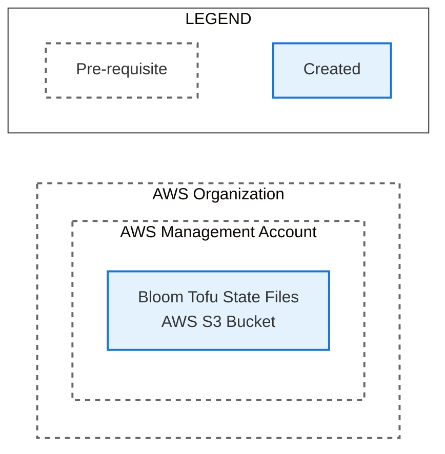

# Create OpenTofu State S3 Bucket

This directory contains instructions for deploying Bloom dev and prod environments to an AWS
organization. The guide is broken down into a series of files that should be followed in order:

1. [Create AWS Accounts](./1_create_aws_accounts.md)
2. [IAM Identity Center Configuration](./2_iam_identity_center_configuration.md)
3. [Create Tofu State S3 Bucket](./3_create_tofu_state_s3_bucket.md) (you are here)
4. [Fork the Bloom Repo](./4_fork_bloom_repo.md)
5. [Apply Deployer Permission Set Tofu Modules](./5_apply_deployer_permission_set_tofu_modules.md)
6. [Apply Bloom Deployment Tofu Modules](./6_apply_bloom_deployment_tofu_modules.md)

The steps in this file create the following resources:



## Required permissions

1. Create a S3 bucket in an AWS account and set its permission policy.

## Before these steps

1. Complete the steps in the [IAM Identity Center
   Configuration](./2_iam_identity_center_configuration.md). The ARNs for the AWS-generated Roles in
   the organization management account and the dev and prod Bloom accounts will be needed.

## Steps

### 1. Create a S3 Bucket to store the OpenTofu state files

An AWS S3 bucket is required to store OpenTofu state files. State files record the results of each
apply command. The S3 bucket can be created in any suitable AWS account in your organization. For
example, the S3 bucket used by the Bloom Core deployments is in Exygy's organization management
account.

Create a S3 bucket:

1. In the 'General configuration' section:
   1. Select the 'General purpose' Bucket type.
   2. Enter a descriptive bucket name. S3 bucket names must be globally unique so different names
      may have to be tried before finding a name that is unused. For example, the S3 bucket used by
      the Bloom Core deployments is named 'bloom-core-tofu-state-files'. **Note the bucket name and
      the AWS region it is created in**.
2. In the 'Object Ownership' section, select the 'ACLs disabled (recommended)' option.
3. In the 'Block Public Access settings for this bucket' section, select the 'Block all public
  access' option.
4. In the 'Bucket Versioning' section, select the 'Enable' option. (this is highly recommended:
  https://opentofu.org/docs/language/settings/backends/s3/).

### 2. Set the S3 Bucket policy

The AWS-generated roles need access to the S3 bucket. On the 'Permissions' tab of the bucket page:

1. Click the 'Edit' button on the 'Bucket policy' section.
2. Paste in the following policy and change:

   - `CHANGEME_S3_BUCKET_NAME` to the S3 bucket name in your notes.
   - `CHANGEME_DEV_IAM_ADMIN_GENERATED_ROLE_ARN` to the ARN of the
     `AWSReservedSSO_bloom-dev-iam-admin_..` AWS-generated role in the organization management
     account in your notes.
   - `CHANGEME_PROD_IAM_ADMIN_GENERATED_ROLE_ARN` to the ARN of the
     `AWSReservedSSO_bloom-prod-iam-admin_..` AWS-generated role in the organization management
     account in your notes.
   - `CHANGEME_DEV_DEPLOYER_GENERATED_ROLE_ARN` to the ARN of the
     `AWSReservedSSO_bloom-dev-deployer_..` AWS-generated role in the dev Bloom account in your
     notes.
   - `CHANGEME_PROD_DEPLOYER_GENERATED_ROLE_ARN` to the ARN of the
     `AWSReservedSSO_bloom-prod-deployer_..` AWS-generated role in the prod Bloom account in your
     notes.

   ```
   {
     "Version": "2012-10-17",
     "Statement": [
       {
         "Sid": "StateBucket",
         "Effect": "Allow",
         "Action": [
           "s3:ListBucket"
         ],
         "Resource": [
           "arn:aws:s3:::CHANGEME_S3_BUCKET_NAME"
         ],
         "Principal": {
           "AWS": [
             "CHANGEME_DEV_IAM_ADMIN_GENERATED_ROLE_ARN",
             "CHANGEME_PROD_IAM_ADMIN_GENERATED_ROLE_ARN",
             "CHANGEME_DEV_DEPLOYER_GENERATED_ROLE_ARN",
             "CHANGEME_PROD_DEPLOYER_GENERATED_ROLE_ARN"
           ]
         }
       },
       {
         "Sid": "DevDeployerPermissionSetStateFiles",
         "Effect": "Allow",
         "Action": [
           "s3:DeleteObject",
           "s3:GetObject",
           "s3:PutObject"
         ],
         "Resource": [
           "arn:aws:s3:::CHANGEME_S3_BUCKET_NAME/bloom-dev-deployer-permissionset-policy/state",
           "arn:aws:s3:::CHANGEME_S3_BUCKET_NAME/bloom-dev-deployer-permissionset-policy/state.tflock"
         ],
         "Principal": {
           "AWS": [
             "CHANGEME_DEV_IAM_ADMIN_GENERATED_ROLE_ARN"
           ]
         }
       },
       {
         "Sid": "ProdDeployerPermissionSetStateFiles",
         "Effect": "Allow",
         "Action": [
           "s3:DeleteObject",
           "s3:GetObject",
           "s3:PutObject"
         ],
         "Resource": [
           "arn:aws:s3:::CHANGEME_S3_BUCKET_NAME/bloom-prod-deployer-permissionset-policy/state",
           "arn:aws:s3:::CHANGEME_S3_BUCKET_NAME/bloom-prod-deployer-permissionset-policy/state.tflock"
         ],
         "Principal": {
           "AWS": [
             "CHANGEME_PROD_IAM_ADMIN_GENERATED_ROLE_ARN"
           ]
         }
       },
       {
         "Sid": "DevStateFiles",
         "Effect": "Allow",
         "Action": [
           "s3:DeleteObject",
           "s3:GetObject",
           "s3:PutObject"
         ],
         "Resource": [
           "arn:aws:s3:::CHANGEME_S3_BUCKET_NAME/bloom-dev/state",
           "arn:aws:s3:::CHANGEME_S3_BUCKET_NAME/bloom-dev/state.tflock"
         ],
         "Principal": {
           "AWS": [
             "CHANGEME_DEV_DEPLOYER_GENERATED_ROLE_ARN"
           ]
         }
       },
       {
         "Sid": "ProdStateFiles",
         "Effect": "Allow",
         "Action": [
           "s3:DeleteObject",
           "s3:GetObject",
           "s3:PutObject"
         ],
         "Resource": [
           "arn:aws:s3:::CHANGEME_S3_BUCKET_NAME/bloom-prod/state",
           "arn:aws:s3:::CHANGEME_S3_BUCKET_NAME/bloom-prod/state.tflock"
         ],
         "Principal": {
           "AWS": [
             "CHANGEME_PROD_DEPLOYER_GENERATED_ROLE_ARN"
           ]
         }
       }
     ]
   }
   ```


## After these steps

Your notes should have:

1. Name and region for the created S3 bucket.
