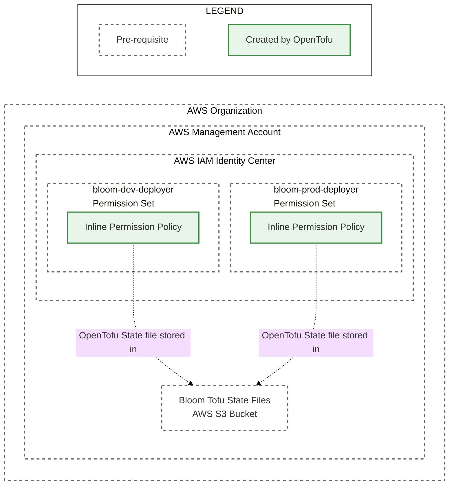

# Apply Deployer Permission Set OpenTofu Modules

This directory contains instructions for deploying Bloom dev and prod environments to an AWS
organization. The guide is broken down into a series of files that should be followed in order:

1. [Create AWS Accounts](./1_create_aws_accounts.md)
2. [IAM Identity Center Configuration](./2_iam_identity_center_configuration.md)
3. [Create Tofu State S3 Bucket](./3_create_tofu_state_s3_bucket.md)
4. [Fork the Bloom Repo](./4_fork_bloom_repo.md)
5. [Apply Deployer Permission Set Tofu Modules](./5_apply_deployer_permission_set_tofu_modules.md)
   (you are here)
6. [Apply Bloom Deployment Tofu Modules](./6_apply_bloom_deployment_tofu_modules.md)

The steps in this file create the following resources:



## Required permissions

1. Be a member of the `bloom-dev-deployers` (or `bloom-dev-iam-admins` if a separate group was
   created in [IAM Identity Center Configuration](./2_iam_identity_center_configuration.md) step 1).
2. Be a member of the `bloom-prod-iam-admins` group.

## Before these steps

1. Complete the steps in [Fork the Bloom Repo](./4_fork_bloom_repo.md). The infra container image
   name build from your fork will be needed.

## Steps

1. Apply the dev deployer OpenTofu root module:

   ```bash
   docker run --rm -it ghcr.io/<YOUR_GITHUB_ORG>/bloom/infra:gitsha-SOMESHA bloom_dev_deployer_permission_set_policy apply
   ```

2. Apply the prod deployer OpenTofu root module:

   ```bash
   docker run --rm -it ghcr.io/<YOUR_GITHUB_ORG>/bloom/infra:gitsha-SOMESHA bloom_prod_deployer_permission_set_policy apply
   ```

## After these steps

1. The `bloom-dev-deployer` permission set should have its Inline policy set.
2. The `bloom-prod-deployer` permission set should have its Inline policy set.
3. The Tofu State S3 bucket should have two folders, `bloom-dev-deployer-permissionset-policy` and
   `bloom-prod-deployer-permissionset-policy`.
