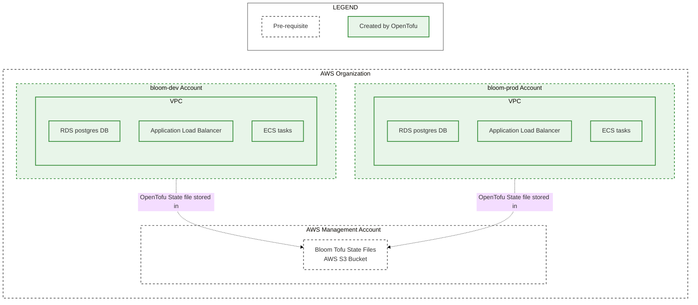

# Apply Bloom Deployment OpenTofu Modules

This directory contains instructions for deploying Bloom dev and prod environments to an AWS
organization. The guide is broken down into a series of files that should be followed in order:

1. [Create AWS Accounts](./1_create_aws_accounts.md)
2. [IAM Identity Center Configuration](./2_iam_identity_center_configuration.md)
3. [Create Tofu State S3 Bucket](./3_create_tofu_state_s3_bucket.md)
4. [Fork the Bloom Repo](./4_fork_bloom_repo.md)
5. [Apply Deployer Permission Set Tofu Modules](./5_apply_deployer_permission_set_tofu_modules.md)
6. [Apply Bloom Deployment Tofu Modules](./6_apply_bloom_deployment_tofu_modules.md) (you are here)

The steps in this file create the following resources (the OpenTofu files in
[bloom_deployment](../tofu_importable_modules/bloom_deployment) fully describe all resources that
are created):



## Required permissions

1. Be a member of the `bloom-dev-deployers` group.
2. Be a member of the `bloom-prod-deployers` group.

## Before these steps

1. Complete the steps in [Apply Deployer Permission Set Tofu
   Modules](./5_apply_deployer_permission_set_tofu_modules.md).

## Steps

### 1. Deploy dev

1. Create the AWS managed certificate for your domain:

   ```bash
   docker run --rm -it ghcr.io/<YOUR_GITHUB_ORG>/bloom/infra:gitsha-SOMESHA bloom_dev apply -exclude=module.bloom_deployment
   ```

2. Validate the AWS managed certificate:

   The `tofu apply` command from step 1 will output the DNS records that need to be added for AWS to
   issue the certificate. Add the two required CNAME records in your DNS provider. For example, the
   following records need to be added for the following output:

   Type | Name | Content
   ---|---|---
   CNAME | _4b8c99d969da11b1e35c36786a74b6fe.core-dev.bloomhousing.dev. | _003be6eab99411307156f79225503c77.jkddzztszm.acm-validations.aws.
   CNAME | _aa08a6efc0ba7025472371c5b7b44120.partners.core-dev.bloomhousing.dev. | _fc0aa55094ea4ea64f60830d3a008225.jkddzztszm.acm-validations.aws.

   ```
   Outputs:

   certificate_details = {
     "certificate_arn" = "<arn>"
     "certificate_status" = "ISSUED"
     "expires_at" = "2026-12-18T23:59:59Z"
     "managed_renewal" = {
       "eligible" = "ELIGIBLE"
       "status" = tolist([])
     }
     "validation_dns_recods" = toset([
       {
         "domain_name" = "core-dev.bloomhousing.dev"
         "resource_record_name" = "_4b8c99d969da11b1e35c36786a74b6fe.core-dev.bloomhousing.dev."
         "resource_record_type" = "CNAME"
         "resource_record_value" = "_003be6eab99411307156f79225503c77.jkddzztszm.acm-validations.aws."
       },
       {
         "domain_name" = "partners.core-dev.bloomhousing.dev"
         "resource_record_name" = "_aa08a6efc0ba7025472371c5b7b44120.partners.core-dev.bloomhousing.dev."
         "resource_record_type" = "CNAME"
         "resource_record_value" = "_fc0aa55094ea4ea64f60830d3a008225.jkddzztszm.acm-validations.aws."
       },
     ])
   }
   ```

3. Deploy Bloom:

   ```bash
   docker run --rm -it ghcr.io/<YOUR_GITHUB_ORG>/bloom/infra:gitsha-SOMESHA bloom_dev apply
   ```

   The output will include a `aws_lb_dns_name`. DNS CNAME records
   need to be added that point to the load balancer DNS name. For example, the following records
   need to be added for the following output:

   Type | Name | Content
   ---|---|---
   CNAME | core-dev | bloom-1787634238.us-west-2.elb.amazonaws.com
   CNAME | partners.core-dev | bloom-1787634238.us-west-2.elb.amazonaws.com

   ```
   Outputs:

   aws_lb_dns_name = "bloom-1787634238.us-west-2.elb.amazonaws.com"
   ```

### 2. Deploy prod

1. Create the AWS managed certificate for your domain:

   ```bash
   docker run --rm -it ghcr.io/<YOUR_GITHUB_ORG>/bloom/infra:gitsha-SOMESHA bloom_prod apply -exclude=module.bloom_deployment
   ```

2. Validate the AWS managed certificate:

   The `tofu apply` command from step 1 will output the DNS records that need to be added for AWS to
   issue the certificate. Add the two required CNAME records in your DNS provider. For example, the
   following records need to be added for the following output:

   Type | Name | Content
   ---|---|---
   CNAME | _BLAH.core-prod.bloomhousing.dev. | _BLAH.jkddzztszm.acm-validations.aws.
   CNAME | _BLAH.partners.core-prod.bloomhousing.dev. | _BLAH.jkddzztszm.acm-validations.aws.

   ```
   Outputs:

   certificate_details = {
     "certificate_arn" = "<arn>"
     "certificate_status" = "ISSUED"
     "expires_at" = "2026-12-18T23:59:59Z"
     "managed_renewal" = {
       "eligible" = "ELIGIBLE"
       "status" = tolist([])
     }
     "validation_dns_recods" = toset([
       {
         "domain_name" = "core-prod.bloomhousing.dev"
         "resource_record_name" = "_BLAH.core-prod.bloomhousing.dev."
         "resource_record_type" = "CNAME"
         "resource_record_value" = "_BLAH.jkddzztszm.acm-validations.aws."
       },
       {
         "domain_name" = "partners.core-prod.bloomhousing.dev"
         "resource_record_name" = "_BLAH.partners.core-prod.bloomhousing.dev."
         "resource_record_type" = "CNAME"
         "resource_record_value" = "_BLAH.jkddzztszm.acm-validations.aws."
       },
     ])
   }
   ```

3. Deploy the Bloom services:

   ```bash
   docker run --rm -it ghcr.io/<YOUR_GITHUB_ORG>/bloom/infra:gitsha-SOMESHA bloom_prod apply
   ```

   The output will include a `aws_lb_dns_name`. DNS CNAME records
   need to be added that point to the load balancer DNS name. For example, the following records
   need to be added for the following output:

   Type | Name | Content
   ---|---|---
   CNAME | core-prod | bloom-1787634238.us-west-2.elb.amazonaws.com
   CNAME | partners.core-prod | bloom-1787634238.us-west-2.elb.amazonaws.com

   ```
   Outputs:

   aws_lb_dns_name = "bloom-1787634238.us-west-2.elb.amazonaws.com"
   ```

## After these steps

1. Your dev Bloom deployment should be accessible:
   - public site: `https://<YOUR_DOMAIN>
   - partners site: `https://partners.<YOUR_DOMAIN>
