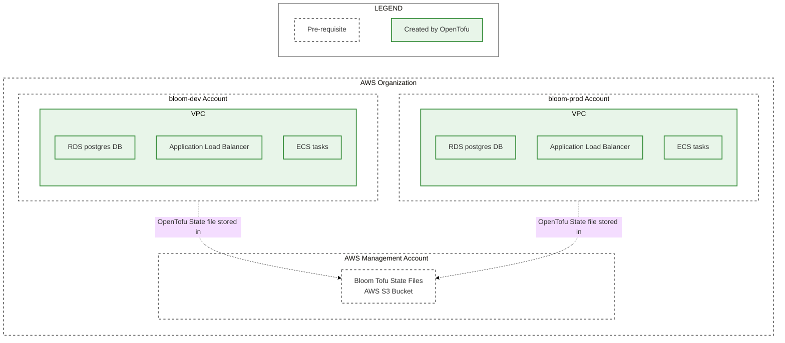

# Apply Bloom Deployment OpenTofu Modules

This directory contains instructions for deploying Bloom dev and prod environments to an AWS
organization. The guide is broken down into a series of files that should be followed in order:

1. [Create AWS Accounts](./1_create_aws_accounts.md)
2. [IAM Identity Center Configuration](./2_iam_identity_center_configuration.md)
3. [Create Tofu State S3 Bucket](./3_create_tofu_state_s3_bucket.md)
4. [Fork the Bloom Repo](./4_fork_bloom_repo.md)
5. [Apply Deployer Permission Set Tofu Modules](./5_apply_deployer_permission_set_tofu_modules.md)
6. [Apply Bloom Deployment Tofu Modules](./6_apply_bloom_deployment_tofu_modules.md) (you are here)
7. [Operations Playbook](./7_operations_playbook.md)

The steps in this file create the following resources (the OpenTofu files in
[bloom_deployment](../tofu_importable_modules/bloom_deployment) fully describe all resources that
are created):



## Required permissions

1. Be a member of the `bloom-dev-deployers` group.
2. Be a member of the `bloom-prod-deployers` group.

## Before these steps

1. Complete the steps in [Apply Deployer Permission Set Tofu
   Modules](./5_apply_deployer_permission_set_tofu_modules.md).

## Steps

### 1. Deploy dev

1. Create the AWS managed certificate for your domain:

   ```bash
   docker run --rm -it ghcr.io/<YOUR_GITHUB_ORG>/bloom/infra:gitsha-SOMESHA bloom_dev apply -exclude=module.bloom_deployment
   ```

2. Validate the AWS managed certificate:

   The `tofu apply` command from step 1 will output the DNS records that need to be added for AWS to
   issue the certificate. Add the two required CNAME records in your DNS provider then wait for AWS
   to validate the certificate (can take a few minutes).

   For example, the following records need to be added for the following output:

   Type | Name | Content
   ---|---|---
   CNAME | _4b8c99d969da11b1e35c36786a74b6fe.core-dev.bloomhousing.dev. | _003be6eab99411307156f79225503c77.jkddzztszm.acm-validations.aws.
   CNAME | _aa08a6efc0ba7025472371c5b7b44120.partners.core-dev.bloomhousing.dev. | _fc0aa55094ea4ea64f60830d3a008225.jkddzztszm.acm-validations.aws.

   ```
   Outputs:

   certificate_details = {
     "certificate_arn" = "<arn>"
     "certificate_status" = "ISSUED"
     "expires_at" = "2026-12-18T23:59:59Z"
     "managed_renewal" = {
       "eligible" = "ELIGIBLE"
       "status" = tolist([])
     }
     "validation_dns_records" = toset([
       {
         "domain_name" = "core-dev.bloomhousing.dev"
         "resource_record_name" = "_4b8c99d969da11b1e35c36786a74b6fe.core-dev.bloomhousing.dev."
         "resource_record_type" = "CNAME"
         "resource_record_value" = "_003be6eab99411307156f79225503c77.jkddzztszm.acm-validations.aws."
       },
       {
         "domain_name" = "partners.core-dev.bloomhousing.dev"
         "resource_record_name" = "_aa08a6efc0ba7025472371c5b7b44120.partners.core-dev.bloomhousing.dev."
         "resource_record_type" = "CNAME"
         "resource_record_value" = "_fc0aa55094ea4ea64f60830d3a008225.jkddzztszm.acm-validations.aws."
       },
     ])
   }
   ```

3. Deploy Bloom:

   ```bash
   docker run --rm -it ghcr.io/<YOUR_GITHUB_ORG>/bloom/infra:gitsha-SOMESHA bloom_dev apply
   ```

4. Add DNS records for the public and partner site URLs:

   The `tofu apply` command from step 3 will output a `aws_lb_dns_name`. DNS CNAME records need to
   be added that point to the load balancer DNS name. For example, the following records need to be
   added for the following output:

   Type | Name | Content
   ---|---|---
   CNAME | core-dev | bloom-1787634238.us-west-2.elb.amazonaws.com
   CNAME | partners.core-dev | bloom-1787634238.us-west-2.elb.amazonaws.com

   ```
   Outputs:

   aws_lb_dns_name = "bloom-1787634238.us-west-2.elb.amazonaws.com"
   ```

5. Validate the AWS SES identities:

   The `tofu apply` command from step 3 will output the validation instructions for each email
   address or domain configured in the `ses_identities` parameter in the `module
   "bloom_deployment"`.

   SES starts in sandbox mode in new AWS accounts:
   https://docs.aws.amazon.com/ses/latest/dg/request-production-access.html. For the Bloom dev
   environment, this is not necessarily an issue that prevents basic email testing. Mail can be sent
   to any validated SES identities (either individual email accounts or entire domains).

   Individual emails are validated by clicking an email validation link AWS sends in an email with
   subject like 'Amazon Web Services - Email Address Verification Request in region...'.

   Domains are validated by publishing a set of DNS records. Add the required CNAME records in your
   DNS provider then wait for AWS to validate the identity (can take a few minutes).

   For example, the following records need to be added for the following output:

   Type | Name | Content
   ---|---|---
   CNAME | ozqvewxzofhgs6diy4cl264nl32y4tyh._domainkey.exygy.dev | ozqvewxzofhgs6diy4cl264nl32y4tyh.dkim.amazonses.com
   CNAME | 634camib7loz4rj2iqxynvvnhqyldflc._domainkey.exygy.dev | 634camib7loz4rj2iqxynvvnhqyldflc.dkim.amazonses.com
   CNAME | exnsjhrdx7tfmjqoguid3uaew3o4pj5v._domainkey.exygy.dev | exnsjhrdx7tfmjqoguid3uaew3o4pj5v.dkim.amazonses.com

   ```
   Outputs:

   ses_details = [
     {
       "identity" = "avritt.rohwer@exygy.com"
       "validation_dns_records" = null /* tuple */
       "verification_instructions" = "Use email verification (click link in email to this address with subject 'Amazon Web Services - Email Address Verification Request in region...')"
       "verification_status" = "SUCCESS"
       "verified_for_sending_status" = true
     },
     {
       "identity" = "exygy.dev"
       "validation_dns_records" = [
         {
           "record_name" = "ozqvewxzofhgs6diy4cl264nl32y4tyh._domainkey.exygy.dev"
           "record_type" = "CNAME"
           "record_value" = "ozqvewxzofhgs6diy4cl264nl32y4tyh.dkim.amazonses.com"
         },
         {
           "record_name" = "634camib7loz4rj2iqxynvvnhqyldflc._domainkey.exygy.dev"
           "record_type" = "CNAME"
           "record_value" = "634camib7loz4rj2iqxynvvnhqyldflc.dkim.amazonses.com"
         },
         {
           "record_name" = "exnsjhrdx7tfmjqoguid3uaew3o4pj5v._domainkey.exygy.dev"
           "record_type" = "CNAME"
           "record_value" = "exnsjhrdx7tfmjqoguid3uaew3o4pj5v.dkim.amazonses.com"
         },
       ]
       "verification_instructions" = "Add the validation_dns_records in your DNS provider settings."
       "verification_status" = "SUCCESS"
       "verified_for_sending_status" = true
     },
   ]
   ```

### 2. Deploy prod

1. Create the AWS managed certificate for your domain:

   ```bash
   docker run --rm -it ghcr.io/<YOUR_GITHUB_ORG>/bloom/infra:gitsha-SOMESHA bloom_prod apply -exclude=module.bloom_deployment
   ```

2. Validate the AWS managed certificate:

   The `tofu apply` command from step 1 will output the DNS records that need to be added for AWS to
   issue the certificate. Add the two required CNAME records in your DNS provider then wait for AWS
   to validate the certificate (can take a few minutes).

   For example, the following records need to be added for the following output:

   Type | Name | Content
   ---|---|---
   CNAME | _BLAH.core-prod.bloomhousing.dev. | _BLAH.jkddzztszm.acm-validations.aws.
   CNAME | _BLAH.partners.core-prod.bloomhousing.dev. | _BLAH.jkddzztszm.acm-validations.aws.

   ```
   Outputs:

   certificate_details = {
     "certificate_arn" = "<arn>"
     "certificate_status" = "ISSUED"
     "expires_at" = "2026-12-18T23:59:59Z"
     "managed_renewal" = {
       "eligible" = "ELIGIBLE"
       "status" = tolist([])
     }
     "validation_dns_records" = toset([
       {
         "domain_name" = "core-prod.bloomhousing.dev"
         "resource_record_name" = "_BLAH.core-prod.bloomhousing.dev."
         "resource_record_type" = "CNAME"
         "resource_record_value" = "_BLAH.jkddzztszm.acm-validations.aws."
       },
       {
         "domain_name" = "partners.core-prod.bloomhousing.dev"
         "resource_record_name" = "_BLAH.partners.core-prod.bloomhousing.dev."
         "resource_record_type" = "CNAME"
         "resource_record_value" = "_BLAH.jkddzztszm.acm-validations.aws."
       },
     ])
   }
   ```

3. Deploy the Bloom services:

   ```bash
   docker run --rm -it ghcr.io/<YOUR_GITHUB_ORG>/bloom/infra:gitsha-SOMESHA bloom_prod apply
   ```

4. Add DNS records for the public and partner site URLs:

   The `tofu apply` command from step 3 will output a `aws_lb_dns_name`. DNS CNAME records need to be
   added that point to the load balancer DNS name. For example, the following records need to be
   added for the following output:

   Type | Name | Content
   ---|---|---
   CNAME | core-prod | bloom-1787634238.us-west-2.elb.amazonaws.com
   CNAME | partners.core-prod | bloom-1787634238.us-west-2.elb.amazonaws.com

   ```
   Outputs:

   aws_lb_dns_name = "bloom-1787634238.us-west-2.elb.amazonaws.com"
   ```

5. Validate the AWS SES identities:

   The `tofu apply` command from step 3 will output the validation instructions for each email
   address or domain configured in the `ses_identities` parameter in the `module
   "bloom_deployment"`.

   SES starts in sandbox mode in new AWS accounts:
   https://docs.aws.amazon.com/ses/latest/dg/request-production-access.html. Follow the AWS
   instructions to take SES out of sandbox mode. Follow the quota request instructions at
   https://docs.aws.amazon.com/ses/latest/dg/manage-sending-quotas-request-increase.html to request
   a sending quota and sending rate required by your Bloom deployment.

   Individual emails are validated by clicking an email validation link AWS sends in an email with
   subject like 'Amazon Web Services - Email Address Verification Request in region...'. If using
   a no-reply email address that does not receive email, you must either give it an inbox first then
   validate in AWS or use domain validation.

   Domains are validated by publishing a set of DNS records. Add the required CNAME records in your
   DNS provider then wait for AWS to validate the identity (can take a few minutes).

   For example, the following records need to be added for the following output:

   Type | Name | Content
   ---|---|---
   CNAME | ozqvewxzofhgs6diy4cl264nl32y4tyh._domainkey.exygy.dev | ozqvewxzofhgs6diy4cl264nl32y4tyh.dkim.amazonses.com
   CNAME | 634camib7loz4rj2iqxynvvnhqyldflc._domainkey.exygy.dev | 634camib7loz4rj2iqxynvvnhqyldflc.dkim.amazonses.com
   CNAME | exnsjhrdx7tfmjqoguid3uaew3o4pj5v._domainkey.exygy.dev | exnsjhrdx7tfmjqoguid3uaew3o4pj5v.dkim.amazonses.com

   ```
   Outputs:

   ses_details = [
     {
       "identity" = "exygy.dev"
       "validation_dns_records" = [
         {
           "record_name" = "ozqvewxzofhgs6diy4cl264nl32y4tyh._domainkey.exygy.dev"
           "record_type" = "CNAME"
           "record_value" = "ozqvewxzofhgs6diy4cl264nl32y4tyh.dkim.amazonses.com"
         },
         {
           "record_name" = "634camib7loz4rj2iqxynvvnhqyldflc._domainkey.exygy.dev"
           "record_type" = "CNAME"
           "record_value" = "634camib7loz4rj2iqxynvvnhqyldflc.dkim.amazonses.com"
         },
         {
           "record_name" = "exnsjhrdx7tfmjqoguid3uaew3o4pj5v._domainkey.exygy.dev"
           "record_type" = "CNAME"
           "record_value" = "exnsjhrdx7tfmjqoguid3uaew3o4pj5v.dkim.amazonses.com"
         },
       ]
       "verification_instructions" = "Add the validation_dns_records in your DNS provider settings."
       "verification_status" = "SUCCESS"
       "verified_for_sending_status" = true
     },
   ]
   ```

### 3. (Optional) Create a VPC peering connection to an existing VPC

Some users of Bloom have an existing database they will import data from. The bloom_deployment
module supports creating a VPC peering connection to an existing AWS VPC to support this use-case.

Bloom must be deployed to the same region the existing VPC is in. Processes that import data must
run in the existing VPC in a known security group. They are expected to connect directly to the
Bloom database. The CIDR range used for the Bloom VPC must not overlap with any CIDR ranges used by
the existing VPC. To create the VPC peering:

1. Set the `vpc_peering_settings` parameter in the `module "bloom_deployment"` with:
    1. The AWS project number where the existing database lives.
    2. The VPC id where the existing database lives.
    3. The security group that the data import process will run with.
    4. The CIDR range for the subnet the data import process will run in.
2. Apply the Bloom deployment root module:

   ```bash
   docker run --rm -it ghcr.io/<YOUR_GITHUB_ORG>/bloom/infra:gitsha-SOMESHA <bloom_dev|bloom_prod> apply
   ```

   The apply will create the peering connection then return an expected error "VPC peering not accepted. Skipping creation of dependent
   resources".

3. Accept the peering request in the existing VPC:
   1. Log in to the AWS account with the existing VPC and go to the 'VPC > Peering connections'
      page. Select the connection and click the 'Actions > Accept request' button.
    2. Go to the Route table associated with the subnet the data import process will run in. Add
       a route with the Bloom VPC CIDR range (the default in 10.0.0.0/22) as the Destination and the
       peering connection as the Target.
    3. Ensure the security group the data import process will run with can send traffic to the Bloom
       VPC CIDR range on port 5432.
4. Apply the Bloom deployment root module again once the peering connection shows 'Active' in both
   VPCs. The rest of the required resources will be created in the Bloom AWS account.
5. Run the data migration script. The Bloom database DNS name is output from the apply. For example:

   ```
   Outputs:

   aws_db_dns_name = "bloom.czkyasygafrh.us-west-2.rds.amazonaws.com"
   ```

   Connect as either the `master` database user or the `bloom_api` database user.

   - `master`: Log in to the Bloom AWS account and go to the 'Aurora and RDS > Databases > bloom'
     page. On the 'Connectivity & security' tab, click the 'Secret Manager Copy view in Secrets
     Manager' button to copy the password. Once the migration script has run, rotate the master user
     secret.

   - `bloom_api`: Generate a password with `aws rds generate-db-auth-token --hostname
     <aws_db_dns_name> --port 5432 --username bloom_api`. The password is valid for 15 minutes.

   The Bloom tables are in the `bloom_prisma` database.

6. Once the data has been migrated, remove the VPC peering. Delete the `vpc_peering_settings`
   parameter in the `module "bloom_deployment"` and apply the root module. Remove the route in the
   existing VPC subnet route table. Remove the security group egress rule in the existing VPC
   security group if added.


## After these steps

1. Your dev Bloom deployment should be accessible:
   - public site: `https://<YOUR_DEV_DOMAIN>`
   - partners site: `https://partners.<YOUR_DEV_DOMAIN>`

2. Your prod Bloom deployment should be accessible:
   - public site: `https://<YOUR_PROD_DOMAIN>`
   - partners site: `https://partners.<YOUR_PROD_DOMAIN>`
