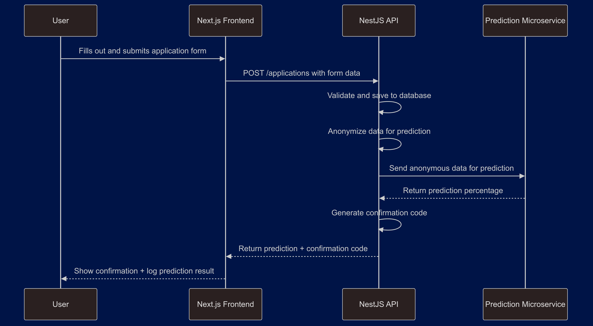

# 🏠 Housing Service Prediction Microservice

This Flask-based microservice provides a `/predict` endpoint that returns a risk score based on anonymized housing-related application data. It's designed to be called by an external service — such as a Nest.js backend — at `http://localhost:5000/predict`.

> 📢 **Note**: If you're running this with Docker or Kubernetes, make sure to update the hostname/IP in your Nest.js `application-service` to reflect the correct endpoint.

---

## 📁 Folder Structure

```
model/
├── app/
│   ├── main.py              # Flask app with /predict endpoint
│   └── model.pkl            # Trained XGBoost model (generated by utils/train_model.py)
├── utils/
│   ├── train_model.py       # Script to generate training data and save model.pkl
│   └── test_prediction.py   # Sends test POST request to /predict endpoint
├── Dockerfile               # For containerizing the Flask microservice
├── requirements.txt         # Python dependencies
├── deployment.yaml          # Kubernetes Deployment config
├── service.yaml             # Kubernetes Service config
└── README.md                # You’re here!
```

---

## 🧪 Test Locally (No Docker or Kubernetes)

1. **Set up your virtual environment**:

   ```bash
   python -m venv venv
   source venv/bin/activate  # On Windows: venv\Scripts\activate
   ```

2. **Install dependencies**:

   ```bash
   pip install -r requirements.txt
   ```

3. **Train the model** (this creates `app/model.pkl`):

   ```bash
   python utils/train_model.py
   ```

4. **Start the Flask app**:

   First, move into the `app/` directory:

   ```bash
   cd app
   python main.py
   ```

   The microservice will be running at:  
   `http://localhost:5000/predict`

5. **Test the endpoint**:

   (in a separate terminal, from the model/ directory):

   ```bash
   python utils/test_prediction.py
   ```

---

## 🐳 Run with Docker

1. **Build the image**:

   ```bash
   docker build -t housing-service .  
   ```

2. **Run the container**:

   ```bash
   docker run -p 5000:5000 housing-service
   ```

3. **Test the endpoint** (in another terminal):

   ```bash
   python utils/test_prediction.py
   ```

---

## ☸️ Run with Kubernetes (Minikube)

### 🔧 Start Minikube

```bash
minikube start
```

If you're using local Docker images:

```bash
eval $(minikube docker-env)
docker build -t housing-service .
```

### 📦 Apply Kubernetes config

```bash
kubectl apply -f deployment.yaml
kubectl apply -f service.yaml
```

### 🌐 Expose the service

To forward the service to your machine's port:

```bash
kubectl port-forward housing-service-loadbalancer 5000:5000
```

Or to open it in your browser:

```bash
minikube service housing-service-loadbalancer
```

---

## 📡 Prediction API

### `POST /predict`

Sends anonymized housing-related features to get a risk score prediction.

#### 📥 Request Body

```json
{
  "features": {
    "income": 1800,
    "household_size": 3,
    "housing_status": 1,
    "income_vouchers": true,
    "household_expecting_changes": false,
    "household_student": true
  }
}
```

> All fields are required. `housing_status` is encoded numerically (e.g., 0: homeless, 1: renting, 2: stable).

#### 📤 Response

```json
{
  "risk_score": 0.82,
  "message": "Risk score represents likelihood of being unhoused (0 to 1, higher is riskier)"
}
```

#### ⚠️ Errors

- `400`: Missing or malformed fields  
- `500`: Internal server error (e.g., model not found)

---

## 🔁 System Flow: Next.js → NestJS → Microservice

This diagram shows the data flow through the system:

1. A user submits their application via the **Next.js frontend**.
2. The **NestJS backend** receives the application data, anonymizes it, and sends a `POST` request to the `/predict` endpoint exposed by this Flask microservice.
3. The **Flask microservice** uses a trained ML model to compute a risk score and responds with a prediction.
4. The **NestJS backend** then returns this result to the frontend for further user interaction or display.

<p align="center">
  
</p>

---

## 🛠 Model Training

The model is trained using synthetic housing data generated by `utils/train_model.py`. It outputs `model.pkl` in the `app/` directory.

> ✅ **Best Practice**: Run this script before building your Docker image or deploying to Kubernetes.

---

## 🧪 Testing

You can run `utils/test_prediction.py` to test the microservice locally or on any live deployment.

---

## 🧘 Privacy & Ethics

This service must only receive **anonymized** data — no names, contact info, or personally identifiable information (PII) should ever be sent.

